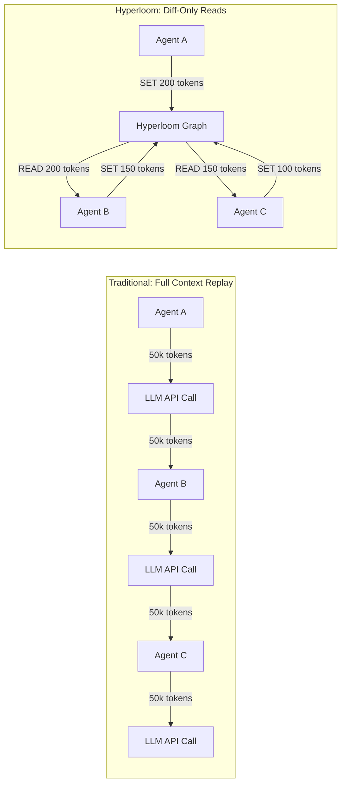
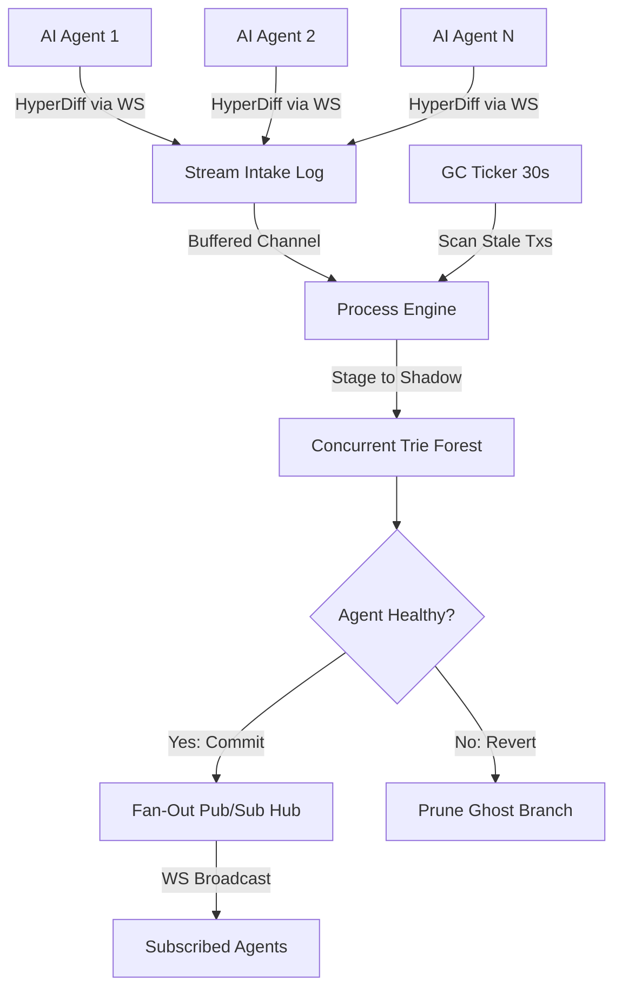

<div align="center">
  <h1>🌌 Hyperloom</h1>
  <p><b>LLM Cost-Optimization & State Recovery Engine for Multi-Agent Systems</b></p>
  <br/>
  <i>Stop paying the Token Tax. Stop restarting crashed pipelines. Ship AI Swarms that are fast, cheap, and resilient.</i>
</div>

---

## The Problem Nobody Talks About

Multi-agent AI frameworks (CrewAI, AutoGen, LangChain) are **financially brutal** at scale. Two architectural failures silently drain budgets:

### 1. The "Token Tax"
If you have 5 agents collaborating on a task, traditional systems serialize the *entire* conversation history (50k–100k tokens) and pass it to **every agent on every turn**. You pay for those tokens every single time an agent thinks—even if it only needs 200 tokens of relevant context.

> A 5-agent pipeline running 10 iterations with a 50k-token context window generates **2.5 million input tokens per run.** At GPT-4o pricing ($2.50/1M input tokens), that's $6.25 per single task execution. Run it 1,000 times/day and you're burning **$6,250/day on redundant context alone.**

### 2. The Cascading Failure Problem
If Agent 4 in an `A → B → C → D` pipeline hallucinates corrupted JSON, the workflow crashes. You lose all API costs spent on Agents A, B, and C. Traditional systems force you to **restart the entire pipeline from scratch**—re-paying for every token.

> In production swarms running 1,000 tasks/day with a 15% agent failure rate, cascading restarts waste an estimated **$900–$1,500/day** in redundant LLM API calls.

---

## How Hyperloom Fixes This

Hyperloom is a single compiled Go binary that replaces your Redis cache, your Postgres state DB, and your orchestration layer with one **concurrent, in-memory state graph**.



**Agents don't pass context.** They read and write *diffs* to a shared memory graph. Each agent queries only the exact sub-tree path it needs.

---

## 🚀 Core Features

- **Node-Level Locking**: `sync.RWMutex` on every Trie node. Agent A updating `/session_1/memory` never blocks Agent B writing to `/session_1/intent`. Zero global locks.
- **Ghost-Branch Rollbacks**: Agents write to invisible "shadow branches." If an agent hallucinates, `Revert()` drops the branch in nanoseconds. You retry **only the failed agent**, not the whole pipeline.
- **Smart JSON Merging**: `OpAppend` automatically deep-merges JSON Objects and appends to JSON Arrays.
- **Real-Time Pub/Sub**: WebSocket fan-out streams committed state changes to subscribed agents instantly.
- **Native MCP Bridge**: Claude Desktop can read/write the graph out of the box via Model Context Protocol.

---

## 💰 The Business Case: Massive Cost & Token Reduction

### 1. Zero-Cost Rollbacks (MTTR Optimization)
In standard frameworks, if Agent D in an `A → B → C → D` pipeline fails, the entire pipeline crashes. You lose the compute and API costs of A, B, and C.

* **With Hyperloom:** The hallucinated output is written to a Ghost Branch. The system detects the failure, calls `Revert()`, and drops the branch in < 1ms. You retry **only** Agent D.
* **Impact:** Eliminates 100% of redundant API calls caused by downstream agent failures.

### 2. The "Token Tax" Elimination
Instead of serializing a massive context blob and passing 100k tokens to every agent on every turn, Hyperloom allows agents to query exactly the sub-tree path they need.

* **Example:** A QA Agent doesn't need `project_requirements`. It subscribes only to the `compiled_code` node and reads 500 tokens instead of 50,000.
* **Impact:** Reduces input token volume by 80–95%, directly cutting OpenAI/Anthropic/Bedrock bills.

### 3. Infrastructure Consolidation
Hyperloom replaces the need for:
| Traditional Stack | Hyperloom Equivalent |
|---|---|
| Redis (context cache) | In-memory Trie with node-level locks |
| Postgres (state persistence) | Append-only event stream |
| Temporal/Celery (orchestration) | Built-in transaction engine |
| Custom rollback scripts | Native Ghost-Branch `Revert()` |

**Result:** One compiled Go binary. Zero external dependencies. Sub-millisecond state operations.

---

## 🎯 Who Uses This?

| Audience | Pain Point | Hyperloom Value |
|---|---|---|
| **Enterprise AI Teams** | Hundreds of LLM calls/min across agent swarms. Can't afford database locks or redundant token costs. | Fine-grained concurrent state graph eliminates blocking and slashes API spend. |
| **LLMOps Infrastructure Startups** | Need a low-latency state backend without clunky Postgres/Redis workarounds. | Single binary, zero external deps, native MCP support. |
| **Advanced Hobbyists & Researchers** | Running local swarms (Ollama) bottlenecked by RAM when passing massive contexts between local agents. | Diff-only architecture dramatically reduces memory pressure. |

---

## 🛠️ Installation

### Option A: Docker (Recommended)
```bash
docker build -t hyperloom .
docker run -p 8080:8080 hyperloom
```
One command. ~15MB image. Zero dependencies on the host.

### Option B: Build from Source
```bash
git clone https://github.com/OckhamNode/hyperloom.git
cd hyperloom
go build -o hyperloom .
./hyperloom
```
The broker starts on `ws://localhost:8080`.

---

## 🔌 MCP Bridge for Claude Desktop

Hyperloom ships with a native **Model Context Protocol (MCP)** server. Claude can read and write to your graph without any code changes.

Add this to your `claude_desktop_config.json`:

```json
{
  "mcpServers": {
    "hyperloom": {
      "command": "go",
      "args": ["run", "./cmd/mcp/main.go"]
    }
  }
}
```

Claude gains two tools: `read_global_memory(path)` and `write_global_memory(path, value)`. Committed updates are instantly broadcast to all subscribed agents.

---

## 🌎 Framework Integrations

### CrewAI — Shared Memory for Worker Agents
```python
import requests

tx_id = "crew_tx_worker_8"

# Agent writes only its diff — not the entire context
requests.post("http://localhost:8080/write", json={
    "tx_id": tx_id,
    "path": "/crewai/project_vulcan/security_scan",
    "op": "APPEND",
    "value": '["Scanned 142 endpoints. 3 vulnerabilities found."]'
})

# Verified clean — commit to global graph
requests.get(f"http://localhost:8080/commit?tx_id={tx_id}")
```

### AutoGen — Supervisor Monitoring via WebSocket
```javascript
const WebSocket = require('ws');

// Supervisor listens ONLY to its team's sub-tree
const ws = new WebSocket('ws://localhost:8080/subscribe?path=/autogen/team_1');

ws.on('message', (data) => {
  const update = JSON.parse(data);
  console.log(`[Supervisor] Agent updated ${update.path}:`, update.value);
  
  // React to worker outputs in real-time
  if (update.path.includes('error')) {
    console.log('Triggering rollback for failed agent...');
  }
});
```

### LangChain — Hallucination Firewall
```python
import requests, json

tx_id = "langchain_tx_42"

# Agent writes speculatively to a Ghost Branch
requests.post("http://localhost:8080/write", json={
    "tx_id": tx_id,
    "path": "/langchain/chain_output",
    "op": "SET",
    "value": json.dumps(llm_response)
})

# Validate before committing
if not is_valid_output(llm_response):
    # Instantly prune the ghost branch — zero cost
    requests.get(f"http://localhost:8080/revert?tx_id={tx_id}")
    print("Hallucination caught. Ghost branch pruned. Retrying agent only.")
else:
    requests.get(f"http://localhost:8080/commit?tx_id={tx_id}")
```

---

## 🧪 Advanced Tri-Matrix Benchmarks

Real-world multi-agent simulation profiles tested on local loopback (Windows x64):

```bash
go run cmd/benchmark/main.go
```

| Benchmark Profile | Sustained Throughput | Avg Latency |
|---|---|---|
| **P1: Read-Heavy Swarm** (90% Reads, 10% Writes) | 2,057 req/s | 193ms |
| **P2: Write-Heavy Conflict** (100% Locked Appends) | 2,076 req/s | 189ms |
| **P3: Hallucination Trim** (Write + Instant Ghost Branch Prune) | 2,330 req/s | 189ms |

*500 concurrent agents. Zero RWMutex deadlocks. Zero data corruption.*

---

## 📐 Architecture



---

## 🧑‍💻 Running Tests

```bash
go test -v ./...
```

The test suite includes:
- **100,000 concurrent goroutine traversals** on the Trie with mixed reads/writes
- **Transaction commit/revert isolation** verification
- **Smart JSON merge** (array append + object deep-merge) correctness
- **Garbage collector** timeout-based automatic rollback

---

<div align="center">
  <sub>Built for engineers who measure architecture in dollars saved, not abstractions added.</sub>
</div>
