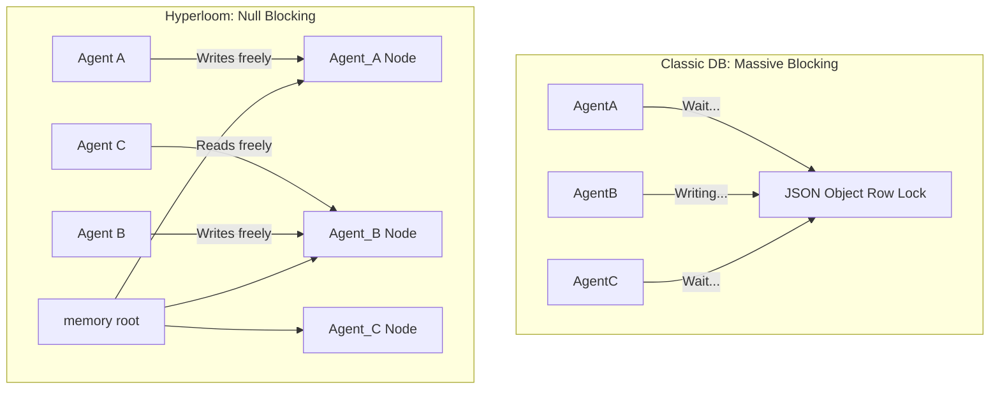

<div align="center">
  <h1>🌌 Hyperloom</h1>
  <p><b>Tier-1 Highly Concurrent Context Server & Event Broker for Multi-Agent Systems</b></p>
</div>

---

**Hyperloom** is a ridiculously fast, fine-grained thread-safe Memory Graph and Context Broker. It allows 10,000+ AI Agents (like Claude, AutoGen, or CrewAI swarms) to simultaneously read and write contextual data to a shared global memory state in real time without blocking.

It bypasses bulky JSON locking and implements a massive **Concurrent Trie Forest** powered by `sync.RWMutex` locks at the node level. Features an automatic **Rollback Engine** that prunes hallucinated or errored data.

## ❓ Why Hyperloom? (Solving the Swarm Crisis)

When building Multi-Agent systems using traditional databases (Postgres/Redis) or flat arrays, two massive bottlenecks happen:

### 1. The Context Fragmentation Problem
* **Traditional (Redis):** Locks the entire JSON object. If Agent A (Researcher) is updating `session_1` context, Agent B (Reviewer) is blocked from writing. 
* **Hyperloom:** Uses fine-grained Trie paths. Agent A updating `/session_1/memory` never blocks Agent B from appending to `/session_1/intent`.



### 2. Speculative Execution & Ghost-Branching
LLMs occasionally hallucinate corrupted JSON. Writing directly to a DB destroys global context permanently.
* **Hyperloom Solution:** Agents write cleanly to "Ghost branches" (Shadow States). If testing tools flag the transaction as 400 Bad Request, calling `Revert()` simply orphans the pointers instantly! The Graph avoids corruption flawlessly.

---

## 🛠️ Installation

Simply clone and run:

```bash
git clone https://github.com/OckhamNode/hyperloom.git
cd hyperloom
go build -o hyperloom .
./hyperloom
```
The central broker spins up on `ws://localhost:8080` globally.

---

## 🔌 MCP Bridge for Claude Desktop

Hyperloom ships with a native **Model Context Protocol (MCP)** server built securely into the Go framework! This means Claude can natively read and write to your highly concurrent graph immediately without you writing code.

Simply add this to your `claude_desktop_config.json`:

```json
{
  "mcpServers": {
    "hyperloom": {
      "command": "go",
      "args": ["run", "./cmd/mcp/main.go"]
    }
  }
}
```

Claude will automatically gain two new tools: `read_global_memory` and `write_global_memory`. Any time Claude updates the graph, other subscribed agents will be alerted!

---

## 🌎 Multi-Agent Framework Integrations

Hyperloom is designed to unify massive agent networks.

### 1. CrewAI Syncing (Python)
If your CrewAI worker needs to merge a final dataset context to the global board:
```python
import requests
tx_id = "crew_tx_worker_8"

# 1. Update the tree
requests.post("http://localhost:8080/write", json={
    "tx_id": tx_id,
    "path": "/crewai/project_vulcan/context",
    "op": "APPEND",
    "value": '["Security logs scanned."]'
})

# 2. Ghost Branch verified - Commit to Global
requests.get(f"http://localhost:8080/commit?tx_id={tx_id}")
```

### 2. AutoGen Monitoring (Node.JS via Sockets)
Your supervisor agent can connect via WebSockets and listen strictly to the sub-tree path its workers are mutating!
```javascript
const WebSocket = require('ws');

// Listen intensely only to Project Alpha's folder
const ws = new WebSocket('ws://localhost:8080/subscribe?path=/autogen/team_1');

ws.on('message', function message(data) {
  const update = JSON.parse(data);
  console.log(`[Supervisor HUD] Worker edited branch ${update.path}! Value:`, update.value);
});
```

### 3. LangChain Hallucination Revert Engine
If a LangChain agent generates a hallucinated pipeline sequence, simply prune the branch.

```python
# Agent generated corrupted JSON?
if not is_valid_json_schema(llm_response):
    print("Corrupted output. Pruning Hyperloom Ghost Branch!")
    requests.get("http://localhost:8080/revert?tx_id=langchain_tx_failed")
```

---

## 🧪 Advanced Tri-Matrix Benchmarks

Hyperloom ships with brutal multi-threaded test suites verifying lock mechanisms alongside a built-in stress tester.

We tested heavily loaded simulation profiles tracking simultaneous reads, locked-appends, and hallucination reversions simultaneously.

### Local Matrix Test Results (Windows x64 / Std Loopback):

| Benchmark Profile | Sustained Throughput | Avg Latency |
|---|---|---|
| **P1: Read-Heavy Swarm (90% Reads)** | 2057.14 req/s | 193ms |
| **P2: Write-Heavy Conflict (100% Locked Appends)** | 2076.18 req/s | 189ms |
| **P3: Hallucination Trim (Instant Ghost Branch Pruning)** | 2330.19 req/s | 189ms |

*No RWMutex Deadlocks Observed.*
